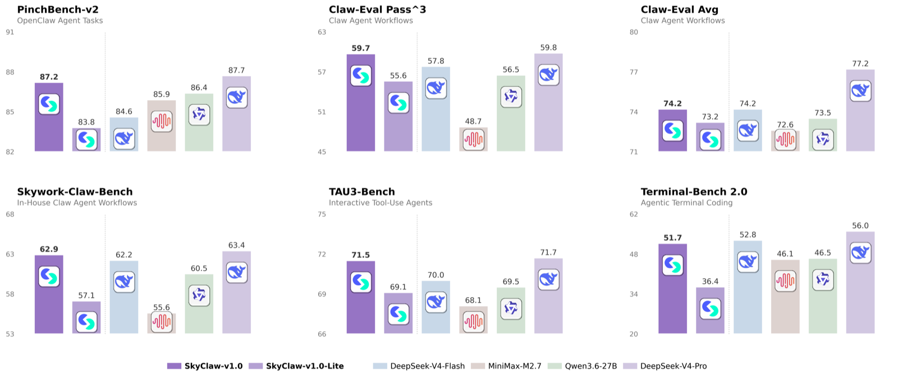
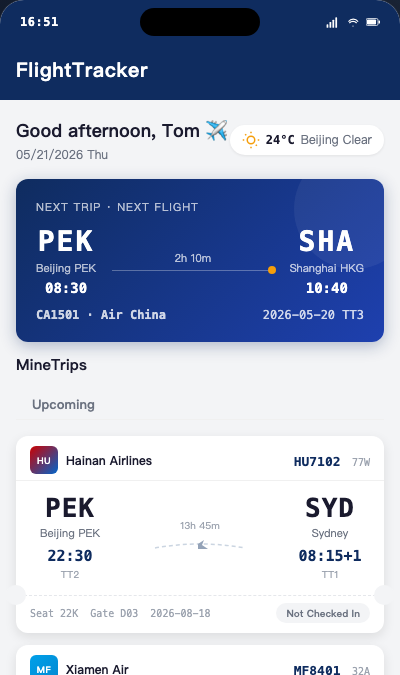

# SkyClaw-v1.0 Release Page

Static GitHub Pages release page for **SkyClaw-v1.0: A Million-Context Agent Model at Ultra-Low Cost**.

The page introduces SkyClaw-v1.0 and SkyClaw-v1.0-lite, benchmark results, API usage, pricing, and agent-framework showcase demos.

## Links

- Try SkyClaw-v1.0: <https://www.apifree.ai/model/skywork-ai/skyclaw-v1?tab=api>
- Try SkyClaw-v1.0-lite: <https://www.apifree.ai/model/skywork-ai/skyclaw-v1-lite?tab=info>

## Page Preview



## Showcase Preview

The page uses local rendered screenshots and short recorded videos instead of embedded remote iframes, keeping the GitHub Pages site faster and more stable while still showing the actual generated demos.

| Demo | Preview |
| --- | --- |
| Flight & Travel Booking App |  |
| Instagram-style Social App |  |
| Xiaohongshu-style App |  |

Animated showcase assets used by the page:

| Demo | Asset | Live demo |
| --- | --- | --- |
| Bouncing Balls in Rotating Frame | `bouncing_balls_preview.mp4` | <https://picture-search.tiangong.cn/skyclaw-demos/bouncing_balls.english.html> |
| Bingo Match Game | `bingo_preview.mp4` | <https://picture-search.tiangong.cn/skyclaw-demos/bingo.html> |
| 2048 Puzzle Game | `2048_preview.mp4` | <https://picture-search.tiangong.cn/skyclaw-demos/2048/index.html> |
| Tetris | `tetris_preview.mp4` | <https://picture-search.tiangong.cn/skyclaw-demos/tetris/index.html> |
| Super Mario Platform Game | `super_mario_preview.mp4` | <https://picture-search.tiangong.cn/skyclaw-demos/mario_game.html> |
| Airplane Battle | `airplane_battle_preview.mp4` | <https://picture-search.tiangong.cn/skyclaw-demos/airplane_battle/index.html> |
| Chess Game | `chess_preview.mp4` | <https://picture-search.tiangong.cn/skyclaw-demos/chess.html> |
| Texas Hold'em Poker | `texas_holdem_preview.mp4` | <https://picture-search.tiangong.cn/skyclaw-demos/texas_holdem/index.html> |
| Financial Terminal (CN) | `financial_terminal_preview.mp4` | <https://picture-search.tiangong.cn/skyclaw-demos/financial_terminal_cn/index.html> |

## Local Preview

Run a static server from this directory:

```bash
python3 -m http.server 8000
```

Then open:

```text
http://localhost:8000/
```

## Main Files

- `index.html` - main release page
- `benchmark_style_chart_1600.png` - optimized benchmark chart used on the page
- `*_preview.png` - rendered app and research preview images used by Showcase cards
- `*_preview.mp4` - animated game and interactive-web previews used by Showcase cards
- `benchmark_style_chart.png` - original large benchmark chart source

## Preview Assets

Current generated preview assets:

- `2048_preview.mp4`
- `airplane_battle_preview.mp4`
- `bingo_preview.mp4`
- `bouncing_balls_preview.mp4`
- `chess_preview.mp4`
- `china_nev_report_preview.png`
- `financial_terminal_preview.mp4`
- `flight_travel_preview.png`
- `flight_travel_preview_crop.png`
- `instagram_preview.png`
- `instagram_preview_crop.png`
- `mag7_report_preview.png`
- `super_mario_preview.mp4`
- `tetris_preview.mp4`
- `texas_holdem_preview.mp4`
- `xiaohongshu_preview.png`
- `xiaohongshu_preview_crop.png`

Regenerate these screenshots or videos when the linked demo pages change.

Example screenshot command:

```bash
"/Applications/Google Chrome.app/Contents/MacOS/Google Chrome" \
  --headless=new \
  --window-size=1200,675 \
  --timeout=8000 \
  --screenshot=demo_preview.png \
  https://example.com/demo.html
```

## Deployment

This is a static site. Deploy by pushing the repository to the branch configured for GitHub Pages.
